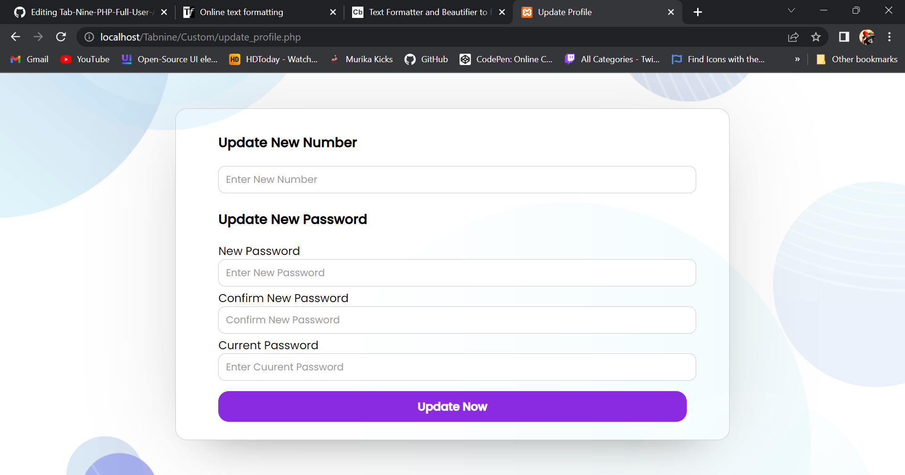
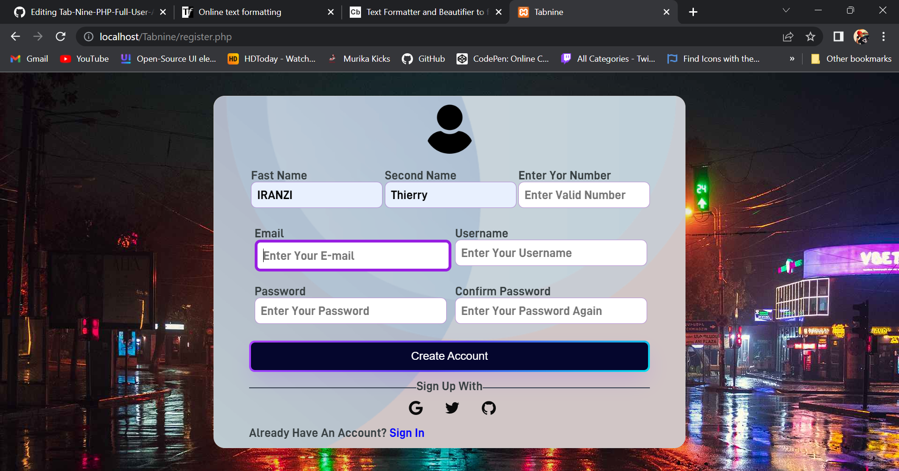
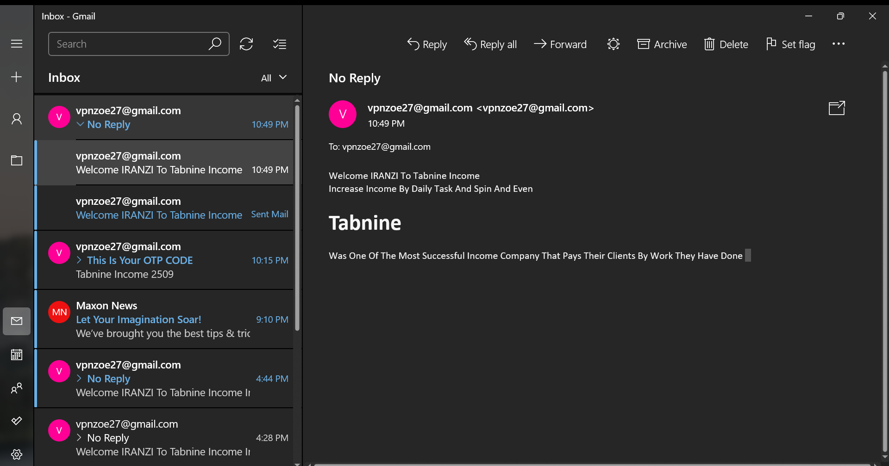
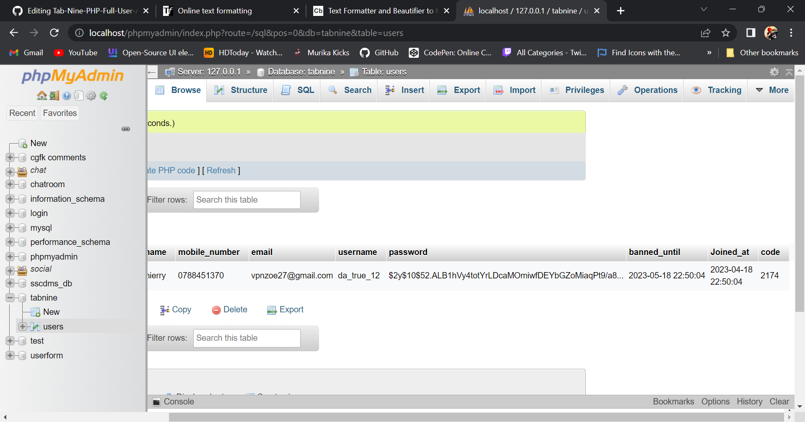
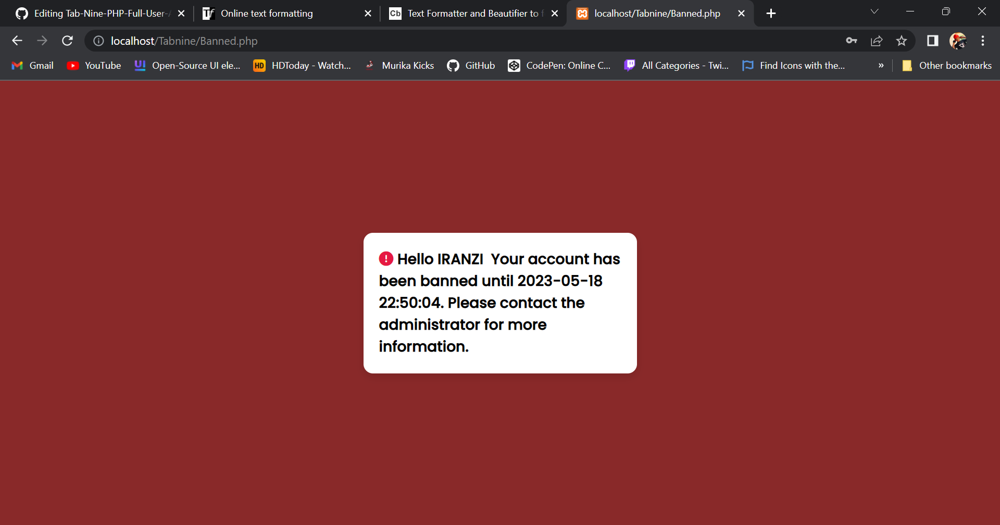

<h2><b>PHP-BASED-FULL-LOGIN-CREDANTIALS

Php System For Email Verification, Password Reset, Credentials Validation, Otp Code Send, And User Email Sending
This Php System Is Designed To Provide Email Verification, Password Reset, Credentials Validation, Otp Code Send, And User Email Sending Functionality To Your Web Application.

Before You Start Using This System, You Should Have The Following Installed:

Installation
Clone This Repository To Your Web Server Using The Following Command:

Git Clone Https://github.Com/iranzithierry/tab-nine-php-full-user-authenticate-with-email-verification.Git

Create A Mysql Database And Import The Tabnine.Sql File From The Sql Folder Into It.

Update The Database Connection Information In The Conn.Php File.

Update The Smtp Server Information In The Register.Php File.

Update The Email Templates In The Email_templates Folder To Fit Your Needs.

Email Verification
To Use The Email Verification Functionality Is In Your Php Script In Register.Php
Dont Forget To Change My Name Iranzi Thierry And My Email Vpnzoe27@gmail.Com
  
 Thank You And Enjoy 
 Https://github.Com/iranzithierry/tab-nine-php-full-user-authenticate-with-email-verification.Git
 
 User Where Update His Credentials
 
 User Where They Register
 
 EMAIL FOR THE REGISTERED USER
 
 DATABASE SCREENSHOT WHERE YOU SEE BANNED USERS
 
 BANNED USERS TEMPLATE WHEN THEY TRY TO ACCESS HOME PAGE
 
 ADMIN PANEL WHERE THEY BAN USERS OR DELETE OR EDIT HIS INFO 

</b></h2>